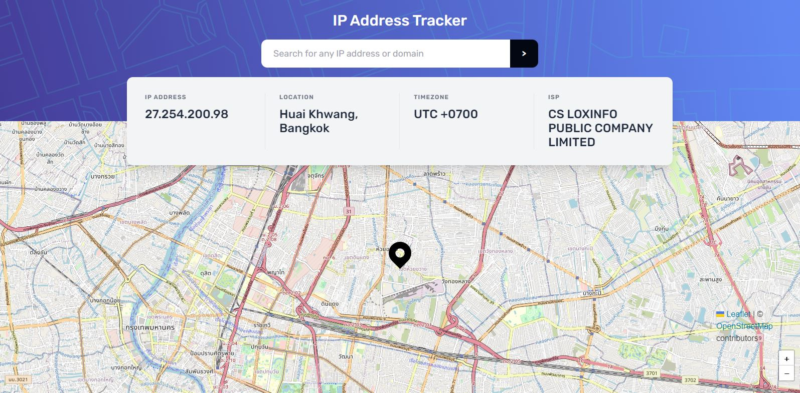
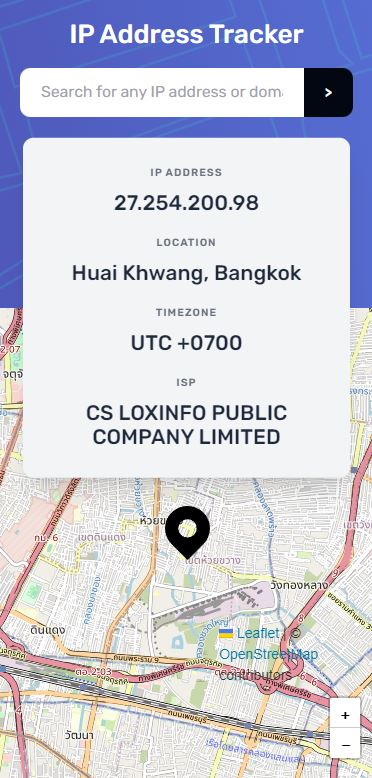

# Frontend Mentor - IP address tracker solution

This is a solution to the [IP address tracker challenge on Frontend Mentor](https://www.frontendmentor.io/challenges/ip-address-tracker-I8-0yYAH0). Frontend Mentor challenges help you improve your coding skills by building realistic projects.

## Table of contents

- [Overview](#overview)
  - [The challenge](#the-challenge)
  - [Screenshot](#screenshot)
  - [Links](#links)
- [My process](#my-process)
  - [Built with](#built-with)
  - [What I learned](#what-i-learned)
  - [Useful resources](#useful-resources)

## Overview

### The challenge

Users should be able to:

- View the optimal layout for each page depending on their device's screen size
- See hover states for all interactive elements on the page
- See their own IP address on the map on the initial page load
- Search for any IP addresses or domains and see the key information and location

### Screenshot




### Links

- Solution URL: [Add solution URL here](https://your-solution-url.com)
- Live Site URL: [Add live site URL here](https://your-live-site-url.com)

## My process

### Built with

- Semantic HTML5 markup
- CSS custom properties
- Flexbox
- CSS Grid
- Mobile-first workflow
- [React](https://reactjs.org/) - JS library
- [Next.js](https://nextjs.org/) - React framework
- [SCSS](https://sass-lang.com/) - For styles
- [Tailwind CSS](https://tailwindcss.com/) - For styles
- [React Hook Form](https://react-hook-form.com/) - For form
- [Leaflet](https://leafletjs.com/) - For interactive maps
- [React Leaflet](https://react-leaflet.js.org/) - For React Leaflet binding

### What I learned

The purpose of this project is to practice tools such as React Hook Form, fetching data and useContext in TypeScript.

Using Leaflet in Next.js also requires import dynamic so that the map doesn't load on server side

```js
import dynamic from "next/dynamic";
const Map = dynamic(() => import("./Map"), {
  ssr: false,
});
export default Map;
```

### Useful resources

- [Next.js data fetching](https://blog.devahoy.com/tutorials/learn-nextjs/05-data-fetching)
- [How to use React Context with TypeScript](https://blog.logrocket.com/how-to-use-react-context-typescript/)
- [Next JS + Leaflet Map Tutorial](https://www.youtube.com/watch?v=Ody2U-fJ580) -
